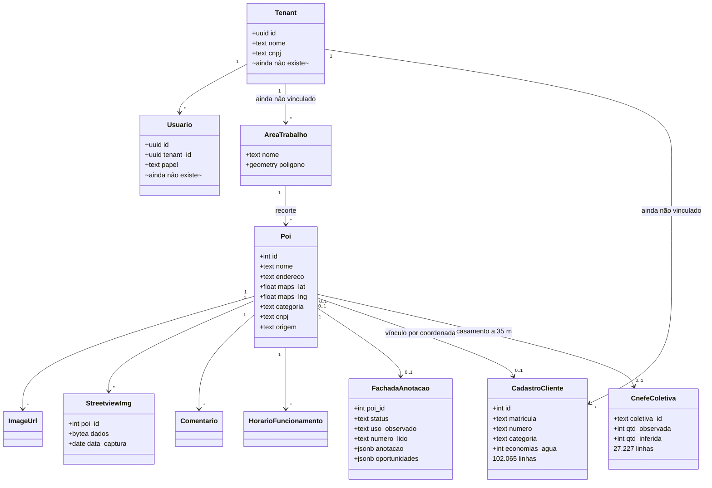
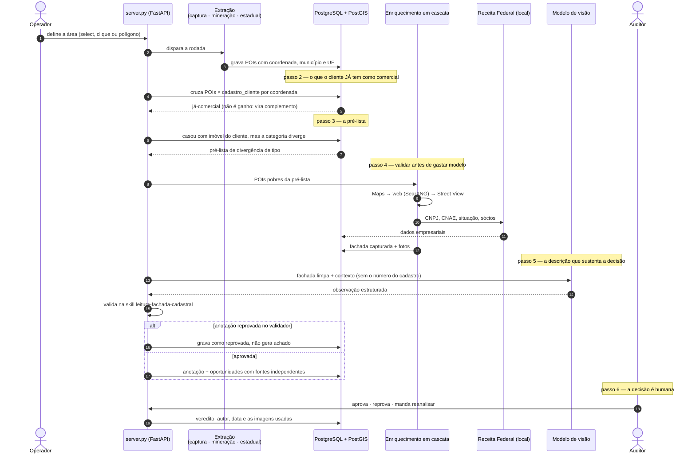

# Arquitetura — ComercialRadar

> Diagrama versionado no repositório e revisado no PR. Diagrama que vive fora do
> código morre em três semanas. Atualizado em 12/08/2026.

---

## Em dez linhas

Um backend **FastAPI** (`server.py`, porta 8765) dispara subprocessos Python que
capturam, mineram e enriquecem POIs, e transmite o progresso ao frontend por
**WebSocket**. O frontend é **Leaflet + OSM** com Google como base opcional.
Todo o processamento pesado fala com o **PostgreSQL + PostGIS** por `psycopg`,
sem ORM e sem camada REST no meio. As bases de referência — CNEFE do IBGE,
Receita Federal, OSM — moram no mesmo banco e são lidas, nunca geradas, por este
sistema. O **radarTelhados** compartilha esse banco e é dono das tabelas de
quadra e telhado.

---

## Entidades

O banco tem 38 tabelas. O diagrama traz as do domínio; as de referência
(`rf_*` com 34 GB, `ibge_cnefe` com 23 GB) aparecem como fonte, não como entidade
do produto.

`Tenant` e `Usuario` estão no diagrama marcados como inexistentes **de
propósito**: o perfil decidido é `saas-multi-cliente` e essas duas entidades são
o buraco entre o que o produto promete e o que o código tem hoje. Escondê-las
faria o diagrama mentir. Ver [CHECKLIST.md](CHECKLIST.md).

---

## Fluxo crítico

Descobrir um imóvel cadastrado como residencial onde funciona comércio — e levar
esse achado até uma decisão humana, com a evidência anexa.

O passo 5 não recebe o número do cadastro. Quando recebia, o modelo devolvia o
número que lhe foi dado e o código depois "conferia" que batia — uma checagem
circular que tornava a divergência de numeração impossível de detectar.

---

## Onde quebra sob carga

A premissa é uso em massa. Os pontos abaixo estão medidos ou identificados, e
nenhum deles é "depois a gente otimiza".

| Ponto | O que acontece | Alternativa |
|---|---|---|
| **Analítico no mesmo Postgres** | `ibge_cnefe` (23 GB) e `rf_estabelecimentos` (17 GB) são varridos por consulta analítica no mesmo servidor que atende o painel. Uma varredura estadual derruba o tempo de resposta de todo mundo | Separar o analítico — réplica de leitura, ou DuckDB sobre Parquet para o que é lote |
| **Sem pooler** | Cada subprocesso Python abre conexão própria. Dezenas de workers em paralelo esgotam `max_connections` antes de esgotar CPU | Supavisor ou PgBouncer em modo transação |
| **Sem `tenant_id`** | Não existe coluna de cliente em nenhuma tabela. Ao introduzir, `tenant_id` tem de ser a **primeira coluna de todo índice**, senão a RLS varre a tabela inteira por linha | `/modelo-acesso` |
| **Imagens em `bytea`** | `streetview_imgs` tem 4,1 GB e `images_urls` 2,2 GB dentro do banco. Backup, restauração e replicação carregam os bytes junto | Object storage (R2) com o banco guardando só a referência |
| **WebSocket direto do backend** | O progresso é transmitido pelo processo que também executa. Com muitos clientes conectados, a transmissão compete com o trabalho | Broadcast publicado por processo separado |
| **`fachada_anotacao` com uma linha por POI** | A chave não inclui o modelo: reprocessar com outro modelo sobrescreve a leitura anterior e o histórico se perde | Chave `(poi_id, modelo)` ou tabela de versões |

---

## Caminho de dados

`psycopg`, direto no Postgres, com PostGIS e `execute_values`. Sem PostgREST e
sem ORM no caminho quente.

Existe um `prisma/schema.prisma` que cobre **6 das 38 tabelas** e cuja última
migration é de 30/06/2026 — legado da primeira versão em TypeScript, não o
caminho de dados atual. Ver [ADR 0002](adr/0002-prisma-legado.md).
